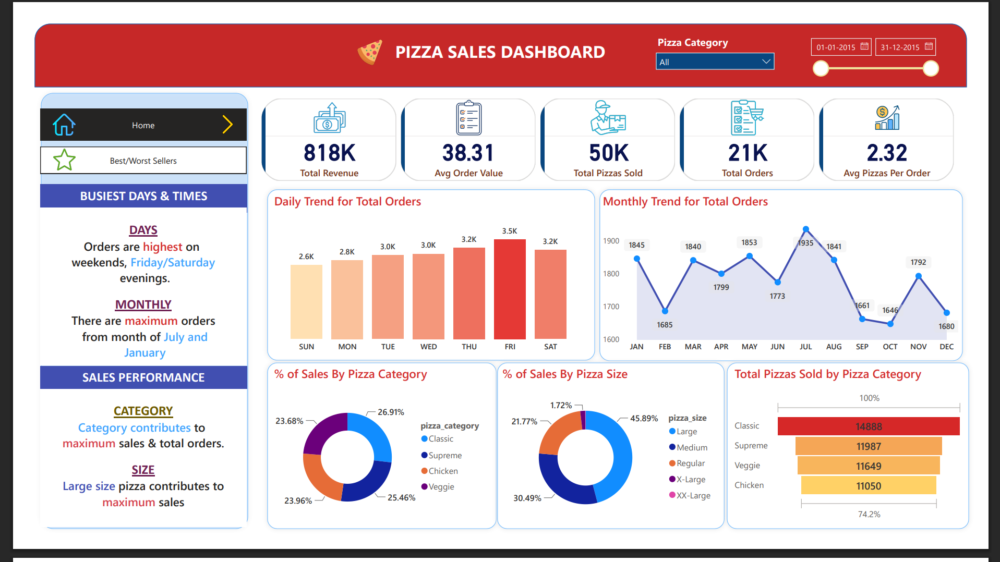

# Pizza Sales Analysis

## Project Overview

This project analyzes pizza sales data using **SQL** and **Power BI** to understand sales performance, order trends, customer ordering patterns, and pizza-level performance.

The analysis covers the period **01-Jan-2015 to 31-Dec-2015** and includes KPI analysis, daily/monthly order trends, category and size contribution, and best/worst-selling pizzas.

## Problem Statement

A pizza business needs a clear view of its sales performance to understand:

* How much revenue is being generated?
* How many orders and pizzas are being sold?
* Which days and months have the highest order volume?
* Which pizza categories and sizes contribute most to sales?
* Which pizzas are the best and worst performers by revenue, quantity, and number of orders?

The objective is to use SQL-based analysis and an interactive Power BI dashboard to convert raw pizza-order data into actionable business insights.

## Dataset

**File:** `pizza_sales.csv`

The dataset contains **48,620 records** and includes fields related to:

* Order ID
* Pizza ID / Pizza Name ID
* Quantity
* Order Date
* Order Time
* Unit Price
* Total Price
* Pizza Size
* Pizza Category
* Pizza Ingredients
* Pizza Name

## Tools & Technologies

* **SQL Server / SQL** — data analysis and business queries
* **Power BI Desktop** — dashboard and visualization
* **CSV** — source dataset

## Key KPIs

| KPI                      |  Result |
| ------------------------ | ------: |
| Total Revenue            | 817.86K |
| Total Orders             |  21,350 |
| Total Pizzas Sold        |  49,574 |
| Average Order Value      |   38.31 |
| Average Pizzas per Order |    2.32 |

## Business Questions & Answers

### 1. What is the total revenue generated?

**Answer:** Total revenue is approximately **817.86K**.

### 2. How many orders were placed?

**Answer:** There were **21,350 distinct orders**.

### 3. How many pizzas were sold?

**Answer:** A total of **49,574 pizzas** were sold.

### 4. What is the average order value?

**Answer:** The average order value is approximately **38.31**.

### 5. How many pizzas are sold per order on average?

**Answer:** Customers purchase approximately **2.32 pizzas per order** on average.

### 6. Which day has the highest number of orders?

**Answer:** **Friday** has the highest number of orders, with **3,538** orders.

### 7. Which month has the highest number of orders?

**Answer:** **July** has the highest number of orders, with **1,935** orders.

### 8. Which pizza category generates the highest revenue?

**Answer:** **Classic** is the highest-revenue pizza category, contributing approximately **26.91%** of total revenue.

### 9. Which pizza size contributes the most to revenue?

**Answer:** **Large (L)** is the highest-contributing pizza size, accounting for approximately **45.89%** of total revenue.

### 10. Which pizza generates the highest revenue?

**Answer:** **The Thai Chicken Pizza** generates the highest revenue, approximately **43.43K**.

### 11. Which pizza has the highest quantity sold?

**Answer:** **The Classic Deluxe Pizza** has the highest quantity sold, with **2,453 pizzas**.

### 12. Which pizza has the highest number of orders?

**Answer:** **The Classic Deluxe Pizza** has the highest number of orders, with **2,329 orders**.

### 13. Which pizza generates the lowest revenue?

**Answer:** **The Brie Carre Pizza** generates the lowest revenue, approximately **11.59K**.

### 14. Which pizza has the lowest quantity sold?

**Answer:** **The Brie Carre Pizza** has the lowest quantity sold, with **490 pizzas**.

### 15. Which pizza has the lowest number of orders?

**Answer:** **The Brie Carre Pizza** has the lowest number of orders, with **480 orders**.

## Business Insights

### Sales Performance

* The business generated approximately **817.86K** in total revenue from **21,350 orders**.
* The average order value is approximately **38.31**.
* Each order contains about **2.32 pizzas** on average.

### Ordering Pattern

* **Friday** is the busiest day based on total orders.
* **July** is the strongest month by total orders.
* Order volume varies across days and months, indicating opportunities for demand-based staffing and promotions.

### Category Performance

* **Classic pizzas** are the largest revenue contributor at approximately **26.91%**.
* Supreme, Chicken, and Veggie categories also contribute substantial portions of overall revenue.

### Size Performance

* **Large pizzas** dominate revenue contribution at approximately **45.89%**.
* Medium pizzas are the next-largest contributor at approximately **30.49%**.

### Product Performance

* **Thai Chicken Pizza** is the top pizza by revenue.
* **Classic Deluxe Pizza** leads in both quantity sold and total orders.
* **Brie Carre Pizza** is the weakest performer across revenue, quantity, and total orders.

### Business Recommendations

* Use **Friday** demand patterns for staffing and inventory planning.
* Consider targeted promotions during lower-order periods to improve demand.
* Maintain strong availability of **Large** pizzas because of their high revenue contribution.
* Promote high-performing pizzas such as **Thai Chicken** and **Classic Deluxe**.
* Review pricing, positioning, ingredients, and customer demand for low-performing products such as **Brie Carre Pizza**.

## SQL Analysis

The project includes SQL queries for:

1. Total Revenue
2. Average Order Value
3. Total Pizzas Sold
4. Total Orders
5. Average Pizzas Per Order
6. Daily Trend for Total Orders
7. Monthly Trend for Orders
8. Percentage of Sales by Pizza Category
9. Percentage of Sales by Pizza Size
10. Total Pizzas Sold by Pizza Category
11. Top 5 Pizzas by Revenue
12. Bottom 5 Pizzas by Revenue
13. Top 5 Pizzas by Quantity
14. Bottom 5 Pizzas by Quantity
15. Top 5 Pizzas by Total Orders
16. Bottom 5 Pizzas by Total Orders

The SQL query document is available as **`pizza_sales_queries.pdf`**.

## Power BI Dashboard

The dashboard provides:

* KPI cards for revenue, orders, pizzas sold, average order value, and average pizzas per order
* Daily order trend
* Monthly order trend
* Sales contribution by pizza category
* Sales contribution by pizza size
* Pizza category quantity analysis
* Top 5 pizzas by revenue
* Bottom 5 pizzas by revenue
* Top 5 pizzas by quantity
* Bottom 5 pizzas by quantity
* Top 5 pizzas by total orders
* Bottom 5 pizzas by total orders
* Pizza category and date filters

### Dashboard Preview



## Repository Structure

```text
Pizza-Sales-Analysis/
│
├── Pizza_Sales_Dashboard.pbix
├── Pizza_Sales_Dashboard.pdf
├── Pizzas sales SQL Queries.sql
├── README.md
├── pizza-sales-dashboard.png
├── pizza_sales.csv
└── pizza_sales_queries.pdf
```

## Project Outcome

This project demonstrates an end-to-end **Data Analytics workflow**: analyzing transactional data with SQL, identifying business trends and product performance, and presenting the results through an interactive Power BI dashboard.
